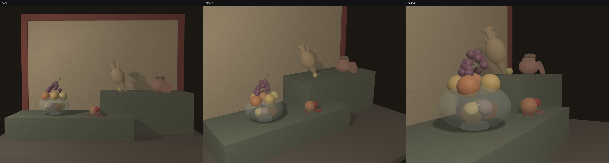
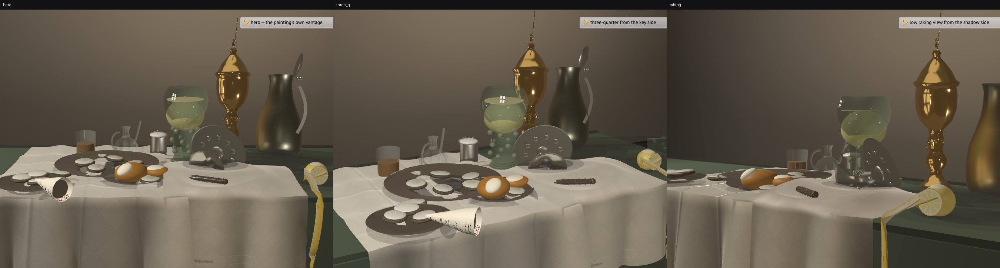
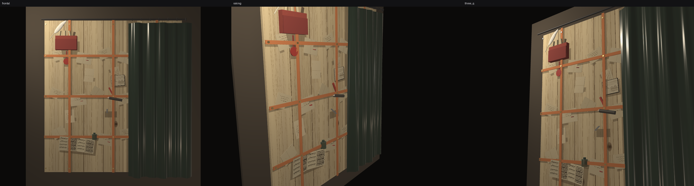

# StillLife_Provenance: Three Still Lifes, Each Carrying Its Own Provenance

Three still-life scenes in X3D 4.0, machine-authored with `x3d.py` 4.0.65.3,
each grounded in a named public-domain painting. Each scene carries a full
account of what it is — source citation, catalog number, rights status, and
generation method — **inside the scene file itself**, as a `MetadataSet
name='provenance'` on the `WorldInfo` node.

These are **interpretive** works: 3D re-stagings of each painting's
composition, palette, and light — inspired by, not reproductions of. No pixels
of any source image are reproduced; all textures are procedurally synthesized
(PIL, embedded as data URIs). The scenes say so themselves: the first metadata
entry in every file is `provenance = "interpretive"`.

| scene | after | source status | scene file | generator |
|---|---|---|---|---|
| antiquity | Pompeian xenia fresco, c. AD 62–79 | probable (attribution) | [scenes/antiquity.x3d](scenes/antiquity.x3d) | [scenes/antiquity.py](scenes/antiquity.py) |
| pronk | Heda, *Still Life with a Gilt Cup*, 1635 | verified | [scenes/pronk.x3d](scenes/pronk.x3d) | [scenes/pronk.py](scenes/pronk.py) |
| trompe | Gijsbrechts, letter-rack trompe l'oeil, 1668 | verified | [scenes/trompe.x3d](scenes/trompe.x3d) | [scenes/trompe.py](scenes/trompe.py) |

## The provenance payload

Every scene opens with the same structure (this one from `pronk.x3d`):

```xml
<WorldInfo title='pronk -- after Heda, Still Life with a Gilt Cup (1635)'>
  <MetadataSet name='provenance'>
    <MetadataString name='provenance'       value='"interpretive"'/>
    <MetadataString name='sourceCitation'   value='"Willem Claesz Heda, ..."'/>
    <MetadataString name='catalogId'        value='"SK-A-4830"'/>
    <MetadataString name='publicDomain'     value='"true"'/>
    <MetadataString name='generationMethod' value='"Procedurally authored with x3d.py ... A 3D
      interpretation of the painting&apos;s arrangement and light; not a measurement
      or scan of the artwork."'/>
  </MetadataSet>
</WorldInfo>
```

An X3D-aware consumer can read the scene's own answer to "what is this and
where did it come from" without any sidecar file.

## 1. antiquity — after the Pompeian glass-bowl xenia panel

**Source:** Unknown Pompeian painter (Fourth Style workshop), *Still Life with
Glass Bowl of Fruit and Vases* (xenia panel from the Praedia of Julia Felix,
Pompeii II.4.3), c. AD 62–79 (fresco; between the earthquake of 62 and the
eruption of 79). Museo Archeologico Nazionale di Napoli (MANN), inv. 8611 —
attribution *probable*.
**Rights:** the fresco is public domain worldwide (anonymous, ~2,000 years
old). Reproduction consulted: [Wikimedia Commons,
`File:Pompejanischer_Maler_um_70_001.jpg`](https://commons.wikimedia.org/wiki/File:Pompejanischer_Maler_um_70_001.jpg)
(Yorck Project — faithful reproduction of a public-domain 2D work).

**What came out:** a two-ledge stone composition against ochre plaster with a
red fresco border; a grey-green transparent glass bowl of fruit (apples,
quinces, grapes) on the lower ledge, an amphora leaning against the wall and a
lidded olla on the upper, a split pomegranate on the ledge front. One warm
raking key; the amphora's cast shadow on the plaster is what grounds it.
Procedural craquelure plaster and stone textures, tiled via TextureTransform.



## 2. pronk — after Heda, *Still Life with a Gilt Cup*

**Source:** Willem Claesz Heda, *Still Life with a Gilt Cup*, 1635 (signed),
oil on panel, 87.8 × 112.6 cm. Rijksmuseum, Amsterdam,
[SK-A-4830](https://www.rijksmuseum.nl/en/collection/SK-A-4830) — verified
against the collection record.
**Rights:** published by the Rijksmuseum as public domain.

**What came out:** the monochrome banketje restated in 3D — every vessel is a
lathe profile swept as an Extrusion (gilt covered cup, pewter jug and plates,
roemer, flute, overturned silver tazza), a computed IndexedFaceSet damask
napkin breaking over the table edge, a helix-Extrusion lemon peel dropping over
the front plate. PBR metals under a single dominant spot key — the metal look
is a lighting outcome, not a material flag (see
[FAILURE_MODES.md](FAILURE_MODES.md) A6).



## 3. trompe — after Gijsbrechts, *Board Partition with Letter Rack and Music Book*

**Source:** Cornelius Norbertus Gijsbrechts (Flemish, c. 1625 – after 1675),
*Trompe l'oeil. Board Partition with Letter Rack and Music Book* (Danish:
*Trompe l'oeil. Brevvæg med kamfoder og nodehæfte*), 1668, signed "C. N.
Gysbrechts. F. Ao 1668". SMK — Statens Museum for Kunst (National Gallery of
Denmark), Copenhagen,
[KMS3059](https://open.smk.dk/en/artwork/image/KMS3059) — verified against the
SMK API record.
**Rights:** SMK API record KMS3059: `public_domain: true`, [CC Public Domain
Mark 1.0](https://creativecommons.org/publicdomain/mark/1.0/).

**What came out:** a shallow-relief wall piece — pine plank partition in a
near-black surround, linen-tape lattice pinned with brass nails, letters tucked
behind the straps, wall pocket with quill, music booklet, penknife in the wood,
and a dark green silk curtain drawn across the right on an iron rod. All depth
within ~10 cm of the picture plane; one warm raking key from upper left; 21
synthesized textures (planks, letters, music page) embedded as data URIs.



## Regenerate

Each generator is self-contained and writes its `.x3d` next to itself
(requires `x3d.py` 4.0.65.3, PIL, numpy; `trompe.py` also lxml):

```
python StillLife_Provenance/scenes/antiquity.py
python StillLife_Provenance/scenes/pronk.py
python StillLife_Provenance/scenes/trompe.py
```

The output is post-processed after serialization — `containerField` injection
with asserted patch counts — because `x3d.py` cannot emit attributes the
scenes' meaning depends on (see below). The patching code is part of the
generator, not an optional cleanup.

## Render

X_ITE is the renderer (X3DOM draws neither PhysicalMaterial nor these
metadata-bearing scenes correctly). Headless rendering and the visual-check
harness live in [lookdev.py](lookdev.py); each generator exposes a
view-parameterized builder for it (`antiquity.builder`, `pronk.scene_builder`,
`trompe.build_xml` + `trompe.VIEWS`):

```python
import sys, os
sys.path.insert(0, "StillLife_Provenance")
sys.path.insert(0, "StillLife_Provenance/scenes")
from lookdev import render_views, analyse, report, contact_sheet
import pronk

paths = render_views(pronk.scene_builder, "pronk", views, w=900, h=700)
for label, p in paths:
    report(label, analyse(p, bg_rgb=pronk.BG_RGB))   # pass the AUTHORED skyColor
contact_sheet(paths, "pronk_sheet.png")
```

The metrics (coverage, black/white clip, dynamic range, key ratio, saturation)
tell you *where* to look; the verdict is made by looking at the PNGs. Every
scene here went through multiple build → render → look → adjust rounds; the
intermediate rounds are kept in [renders/](renders/).

## FAILURE_MODES.md — read it

[FAILURE_MODES.md](FAILURE_MODES.md) documents every failure hit while
building these three scenes, and it is part of the contribution, not an
appendix. The point of this package is a truthful account of machine-authored
3D, and the truthful account includes what failed silently: valid XML whose
textures were dropped because a serializer legally omitted `containerField`;
provenance strings parented into the wrong metadata slot — the payload of this
project failing invisibly; lighting so flat every metric approved it, hit
independently in all three scenes. None of these were schema failures. A
consumer of these scenes (or of this pipeline) needs that record as much as
the scenes themselves.

Known open items from that audit: `pronk.x3d` currently ships with its
`MetadataSet` children unpatched (A2 — the provenance strings sit in the wrong
field until the trompe-style lxml patch is applied and the file re-emitted),
and its `EnvironmentLight` carries no explicit `global` attribute (A3 —
runtime-correct, but the intent is not auditable from the XML). The pronk
contact sheet also shows viewpoint descriptions baked into the captures as UI
pills (A8).
